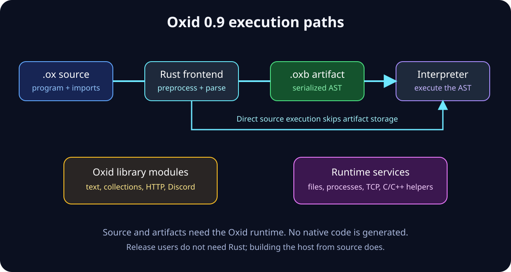
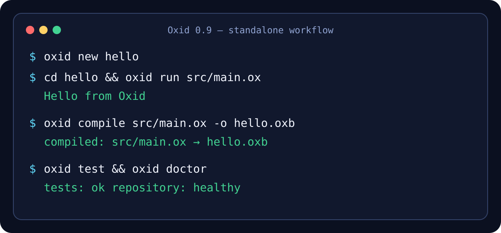
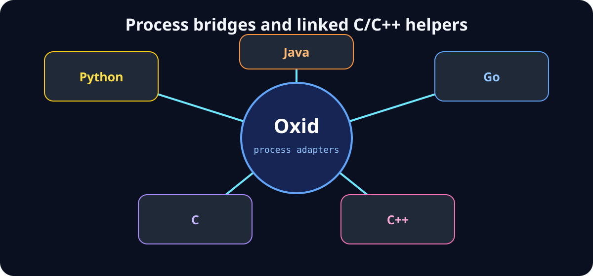
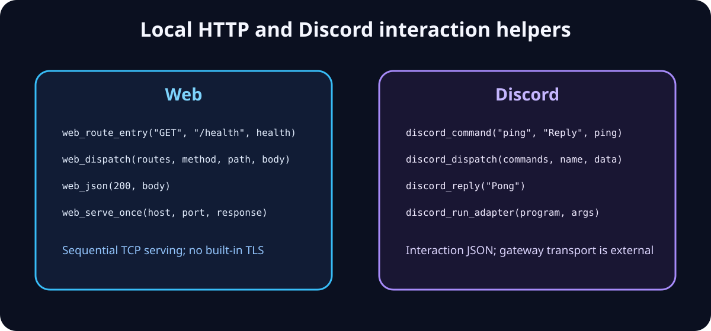

<div align="center">
  

  # Oxid

  **高速なスクリプト、アプリ、バンドル、言語間開発のための簡潔でスタンドアロンな言語。**

  [](https://github.com/YanagiKH/Oxid/actions/workflows/ci.yml)
  [](https://github.com/YanagiKH/Oxid/releases)
  [](LICENSE)

  [English](README.md) · [繁體中文](README_ZH.md) · [日本語](README_JP.md)
</div>

Oxid 0.9 は、簡潔／従来構文、ソースの直接実行、決定的なバージョン付き成果物、レコードと JSON、永続ネットワークアダプタ、ロックされたパス／Git 依存関係、プロジェクトツール、ネイティブ C/C++ 関数、Python／Java／Go プロセスブリッジを備えた実用的な言語ツールチェーンです。一般ユーザーはバイナリを一つインストールするだけで、**Rust は不要**です。

## プロジェクトの状態

Oxid は現在、スクリプト、自動化、教育、プロトタイプ、ローカル HTTP サービス、Discord インタラクションロジック、複数言語のプロセス統合に利用できます。リリースバイナリには、パーサー、ランタイム、OXBC コンパイラ／リーダー、パッケージリゾルバ、ベンチマークハーネス、C/C++ ブリッジ、フォーマッター、テストランナー、doctor、スキャフォールドコマンドが含まれます。

バイトコードエミッターは Oxid で記述され、ブートストラップは stage-0／stage-1／stage-2 成果物の決定的な一致を検証します。レキサー、パーサー、診断、モジュールプロバイダーはまだ Rust stage-0 ブートストラップを使うため、完全に独立したセルフホストはまだ主張しません。Rust が必要なのはそのブートストラップをソースからビルドするときだけで、リリースバイナリによる記述、実行、検査、コンパイル、パッケージ管理、ブリッジには不要です。

## Oxid を選ぶ理由

| 日常の作業 | Rust 風の定型処理 | Oxid 0.9 |
|---|---|---|
| 可変値 | `let mut total = 0;` | `var total = 0;` |
| 出力 | `println!("{value}");` | `say value;` |
| 短い関数 | 関数本体と明示的な return | `fun double(n) => n * 2;` |
| 条件 | 必須の Rust 式構文 | `when ready { ... } otherwise { ... }` |
| 反復 | イテレータ trait または手動ループ | `for item in values { ... }` |
| パイプライン | ネスト呼び出しまたはアダプタ | `value |> clean |> encode;` |
| 非同期宣言 | ランタイムと trait の設定 | `work fun fetch() => await request();` |
| スクリプト実行 | プロジェクトのコンパイル手順 | `oxid run app.ox` |
| 単一成果物 | パッケージターゲット設定 | `oxid compile app.ox -o app.oxb` |
| ロック依存関係 | パッケージクライアントの選定と配線 | `oxid add codec <pinned-git-url>` |
| 構造化データ | シリアライズクレートを追加 | `{name: "Oxid"}`／`json_parse(text)` |
| 外部言語ブリッジ | ホスト側グルーを手書き | `oxid bridge all bridges` |

Oxid は小さな言語コア、前処理キャッシュ、一度だけ解決するモジュール、同じプログラムを直接実行または単一 `.oxb` へコンパイルできる仕組みにより開発効率を高めます。性能はワークロードに依存します。Rust に対する普遍的な固定倍率を仮定せず、`oxid bench` またはアプリ固有の測定を利用してください。

## アーキテクチャ



- レキサーとパーサーは従来キーワードと Oxid の短縮形を両方理解します。
- ランタイムは数値、文字列、真偽値、null、配列、決定的レコード、JSON、タスク、永続 TCP ハンドル、モジュール、ファイル、プロセス、C/C++ ネイティブ呼び出し、上限付き HTTP 解析に対応します。
- コンパイラはインポートを決定的に解決し、シリアライズ AST バージョン 1、ソース範囲、サイズ上限、ペイロードチェックサムを含む OXBC 1.0 を出力します。
- 標準ライブラリは `.ox` モジュールで記述され、コレクション、文字列、ワークフロー、Web ルーティング、Discord ディスパッチ、言語ブリッジ記述を提供します。
- 生成されるブリッジ SDK により、外部ホストはコンパイラ内部を埋め込まず、一貫した方法で Oxid を起動できます。
- `oxid.lock` は再帰的なパス依存関係とコミット固定 Git 依存関係をパッケージツリーのチェックサム付きで記録します。

## クイックスタート



```bash
oxid new hello
cd hello
oxid run src/main.ox
oxid build
oxid test
```

生成プロジェクトにはマニフェスト、空の有効な `oxid.lock`、ソースエントリ、最小 prelude、サンプル、テスト、ビルドスクリプトが含まれます。`oxid build` はプロジェクトを検証し、`.oxid/bin/hello.oxb` を生成します。

## 言語構文

### 従来の表記

```oxid
fn double(value) {
    return value * 2;
}

fn main() {
    let values = range(1, 7);
    print map(values, double);
}
```

### Oxid の簡潔な表記

```oxid
fun double(value) => value * 2;
fun label(value) => "value=" + str(value);

work fun greet(name) => "Hello, " + name;

fun main() {
    const values = range(1, 7);
    for value in values {
        when value % 2 == 0 { continue; }
        say value |> double |> label;
    }

    var job = greet("Oxid");
    say await job;
    say yes all (none == null);
}
```

短縮形は互換エイリアスであり、別の非互換文法ではありません。`fun/fn`、`var/let`、`say/print`、`give/return`、`when/if`、`otherwise/else`、`loop/while`、`import/use`、`yes/true`、`no/false`、`none/null`、`all/and`、`any/or` を利用できます。さらに `for … in`、`break`、`continue`、`%`、`|>`、`=>`、`async`、`await`、配列、決定的レコード、プロパティ／文字列キーアクセス、代入、コメント、1 行マクロを実装しています。

## インストール

### Linux／macOS リリースインストーラー

インストーラーはプラットフォームを検出し、最新のチェックサム付きリリースをダウンロードして SHA-256 を検証し、既定では `${HOME}/.local/bin` に `oxid` を配置します。

```bash
curl --proto '=https' --tlsv1.2 -sSf https://raw.githubusercontent.com/YanagiKH/Oxid/main/install.sh | sh
export PATH="$HOME/.local/bin:$PATH"
oxid --version
```

別のディレクトリには `OXID_INSTALL_DIR`、固定リリースには `OXID_VERSION=<release-tag>` を指定します。公開 Unix 成果物は Linux x86_64、macOS x86_64、macOS arm64 に対応します。

### Windows PowerShell インストーラー

```powershell
Set-ExecutionPolicy -Scope Process Bypass
irm https://raw.githubusercontent.com/YanagiKH/Oxid/main/install.ps1 | iex
& "$env:LOCALAPPDATA\Oxid\bin\oxid.exe" --version
```

PowerShell インストーラーはアーカイブのチェックサムを検証し、Windows x86_64 に対応します。`OXID_INSTALL_DIR` と `OXID_VERSION` で既定値を変更できます。

### ポータブルリリースアーカイブ

1. [GitHub Releases](https://github.com/YanagiKH/Oxid/releases) を開きます。
2. OS に対応するアーカイブをダウンロードします。
3. 隣接する `.sha256` ファイルで検証します。
4. `oxid` または `oxid.exe` を `PATH` 上のディレクトリへ展開します。

ポータブルリリースバイナリに言語ランタイムは不要です。

### Cargo／ソースインストール

stage-0 実装のビルドには stable Rust と C/C++ コンパイラが必要です。

```bash
cargo install --git https://github.com/YanagiKH/Oxid --locked
# または
git clone https://github.com/YanagiKH/Oxid.git
cd Oxid
make verify
sudo make install
```

### Docker

```bash
docker build -t oxid .
docker run --rm -v "$PWD:/workspace" oxid run /workspace/examples/hello.ox
```

コンテナは最適化ランタイムをビルドし、非 root ユーザーで実行します。

## コンパイルとパッケージ

```bash
oxid check src/main.ox
oxid compile src/main.ox -o app.oxb
oxid inspect app.oxb
oxid run app.oxb
oxid lock
oxid build --locked
oxid clean
```

`.oxb` は OXBC 1.0 成果物で、シリアライズ AST バージョン 1、モジュール数、モジュール間ソース範囲、決定的なペイロードチェックサムを含みます。ランタイムは実行前に、非互換、不正、過大、切り詰め、破損した成果物を拒否します。`oxid ast` は同じ表現を `.oxa` 拡張子で書き出します。`oxid build` はマニフェストを解決し、`oxid.lock` を検証して、アプリ成果物とビルドレポートを `.oxid/` に書き込みます。

## 言語間ブリッジ



### Oxid から外部プログラムを呼び出す

```oxid
fun main() {
    say python("-c", ["print('hello from Python')"]);
    say go("tools/report.go", ["--format", "json"]);
    say process_output("java", ["-jar", "service.jar"]);
    say c_hash("native");
    say cpp_hash("bridge");
}
```

`process` は終了コードを返し、`process_output` は標準出力を返して失敗終了を Oxid エラーへ変換します。`python`、`java`、`go` は簡潔なアダプタです。ネイティブの `c_len`、`c_hash`、`cpp_len`、`cpp_hash` は、すべての CI ビルドで ABI 境界のリンクを実証します。

### 他言語から Oxid を呼び出す

```bash
oxid bridge python bridges/python
oxid bridge java bridges/java
oxid bridge go bridges/go
oxid bridge c bridges/c
oxid bridge cpp bridges/cpp
# 全 SDK を一度に生成：
oxid bridge all bridges
```

生成ファイルは各エコシステムの標準プロセス API を使用し、小さな `run` エントリを公開します。これによりプロトコルを安定させ、ホストグルーを交換可能にします。C/C++ シェルアダプタでは、ファイル名とコマンド引数を信頼済みのアプリケーション入力として扱ってください。

## Web モジュール



```oxid
import "stdlib/web.ox";

fun health(body) => web_json(200, "{\"status\":\"ok\"}");
fun echo(body) => web_text(200, body);

fun main() {
    const routes = [
        web_route_entry("GET", "/health", health),
        web_route_entry("POST", "/echo", echo)
    ];
    const response = web_dispatch(routes, "GET", "/health", "");
    web_serve_once("127.0.0.1", 8080, response);
}
```

`stdlib/web.ox` はルートエントリ、ローカルディスパッチ、テキスト／JSON 応答を提供します。ネイティブの `net_listen`、`net_accept`、`net_try_accept`、`net_read`、`net_write`、`http_read_request`、`http_write_response`、`net_close` は、データ量とタイムアウトに上限を持つ再利用可能な非ブロッキングソケットを公開します。`web_serve_once` は単純な 1 リクエストプログラム向けに残っています。TLS、認証、レート制限、本番スケジューリングはアダプタ側の責務です。

## Discord モジュール

```oxid
import "stdlib/bots/discord.ox";

fun ping(payload) => discord_reply("Pong: " + payload);

fun main() {
    const commands = [discord_command("ping", "Reply with pong", ping)];
    say discord_dispatch(commands, "ping", "interaction-data");
}
```

このモジュールは Discord インタラクション応答の構築、コマンド登録、ペイロードのディスパッチ、`discord_run_adapter` によるゲートウェイアダプタ起動を提供します。`oxid discord new my-bot` でトークン対応のプロジェクトを生成できます。HTTPS／WebSocket ゲートウェイ転送は言語コアに固定せず、交換可能なアダプタへ分離します。

## コマンドリファレンス

| コマンド | 用途 |
|---|---|
| `oxid run <file>` | `.ox` ソースまたは検証済み `.oxb`／`.oxa` 成果物を実行 |
| `oxid check <file>` | 実行せずレキシング、前処理、パース |
| `oxid compile <file> [-o output]` | 決定的な OXBC 成果物を生成 |
| `oxid ast <file> [-o output]` | バージョン付きシリアライズ AST を出力 |
| `oxid inspect <artifact>` | 成果物のバージョン、件数、チェックサムを表示 |
| `oxid repl` | 対話型インタプリタを起動 |
| `oxid new/init <name>` | 通常プロジェクトを生成 |
| `oxid web new <name>` | Web プロジェクトを生成 |
| `oxid discord new <name>` | Discord bot プロジェクトを生成 |
| `oxid bridge <target> [output]` | Python／Java／Go／C／C++ ホスト SDK を生成 |
| `oxid build [依存フラグ]` | 解決、ロックして `.oxid/bin/*.oxb` を作成 |
| `oxid test` | 言語スモークテストと主要サンプルを実行 |
| `oxid fmt [path]` | 単一ソースまたはプロジェクト全体を整形 |
| `oxid watch <file>` | プロジェクトファイル変更後に再実行 |
| `oxid script <name> [args]` | `oxid.toml` スクリプトを実行 |
| `oxid add <name> <target>` | 依存関係エントリを追加 |
| `oxid remove/list/lock/fetch/update/install` | パスおよびコミット固定 Git 依存関係を管理 |
| `oxid bench [options]` | コールド起動、解析、パッケージング、ランタイム操作を測定 |
| `oxid doctor` | プロジェクト構造を検査 |
| `oxid doc` | 組み込み API ドキュメントを生成 |
| `oxid clean` | `.oxid` キャッシュ／ビルドディレクトリを削除 |
| `oxid bootstrap/self-host [--check]` | 決定的なコンパイラ段階成果物を検証または書き込み |

## リポジトリ構成

```text
Oxid/
├── src/                  # stage-0 パーサー、ランタイム、CLI、バンドラー
├── compiler/             # Oxid コンパイラエントリとフロントエンドプロバイダーマニフェスト
├── stdlib/               # Oxid 製標準モジュール
│   ├── interop/          # C、C++、Python、Java、Go ブリッジヘルパー
│   └── bots/discord.ox   # Discord コマンド／応答モジュール
├── examples/             # 実行可能な言語、Web、bot、ブリッジ例
├── tests/                # Oxid スモークテストプログラム
├── tools/                # Oxid 製プロジェクト／ツールチェーンスクリプト
├── native/               # リンク済み C／C++ ABI 実装
├── scripts/              # リポジトリ／リリース検証
├── docs/assets/          # README 図表
└── .github/workflows/    # 完全 CI とチェックサム付きリリース
```

## 検証とリリース

すべての push／pull request で次を実行します。

- Rust フォーマットと警告を拒否する Clippy。
- 構文、OXBC 往復、ソース範囲、レコード／JSON、ネットワーク上限、パッケージロック、ブートストラップ一致、ブリッジ、ネイティブ C/C++ リンクの単体テスト。
- すべての `.ox` ファイルの構文検査。
- 全テスト、サンプル、ツール、アプリ、パッケージ demo の実行。
- Linux x86_64、Windows x86_64、macOS x86_64、macOS arm64 の最適化ビルド。
- README 同等性、SVG XML、TOML、JSON、workflow、ソースインストール、Docker の検査。
- プロジェクト `test`、ロック付き `build`、ブートストラップ一致、ベンチマークスキーマ、`doctor` コマンド。

バージョンタグでは、再利用 CI ワークフローの成功後にのみスタンドアロンアーカイブを作成し、SHA-256 ファイルを生成して GitHub Releases へ公開します。

## 独立性とロードマップ

Oxid 0.9 はバージョン付き成果物、Oxid 製エミッター、決定的なブートストラップ比較、明示的なプロバイダーマニフェストを提供します。リリースユーザーは Rust をインストールせずに `oxid`、`.ox`、`.oxb`、`.oxa` を利用できます。レキサー、パーサー、診断、モジュールプロバイダーはまだ stage-0 です。各要素を検証しながら置き換え、独立したクロスプラットフォーム等価性が証明された後にのみ、セルフホスト経路を既定のリリース経路にします。

## セキュリティ

プロセスブリッジは Oxid アプリが指定したプログラムを実行します。信頼できない実行パスやシェル断片を生成 C/C++ アダプタへ渡さないでください。Git 依存関係には HTTPS と完全なコミット指定が必要で、ロックファイルのチェックサム変更を確認してください。ネットワーク／JSON パーサーには上限がありますが、TLS やアプリ認証は提供しません。脆弱性は [SECURITY.md](SECURITY.md) に従って非公開で報告してください。

## コントリビュートとライセンス

[CONTRIBUTING.md](CONTRIBUTING.md) を読み、`make verify` を実行し、公開リポジトリ文書はすべての利用者向けに記述してください。Oxid は [MIT](LICENSE) または [Apache-2.0](LICENSE-APACHE) ライセンスで利用できます。
