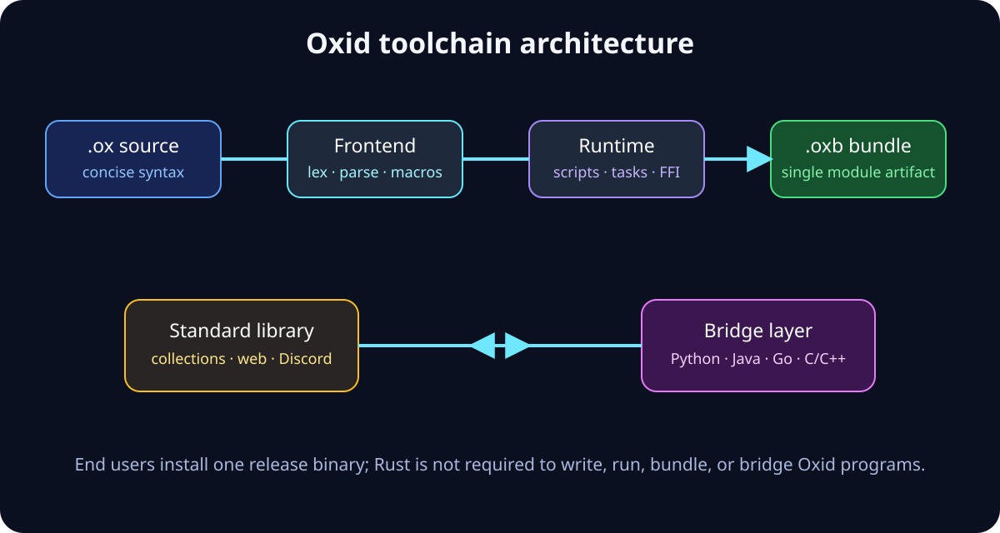
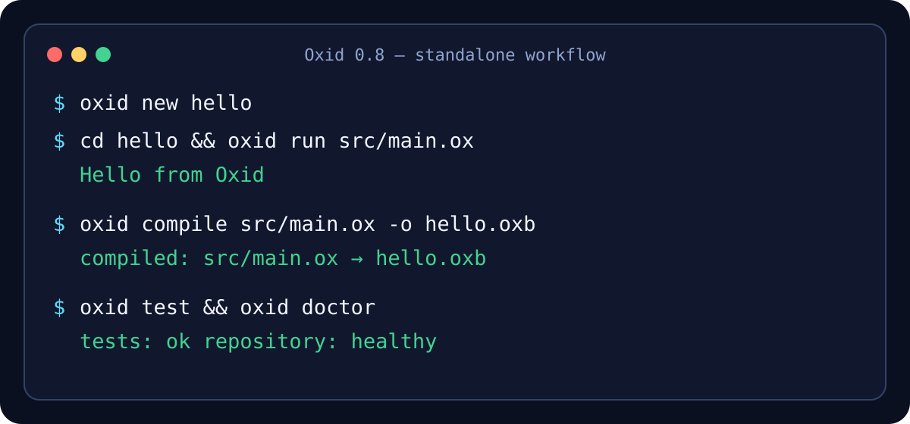
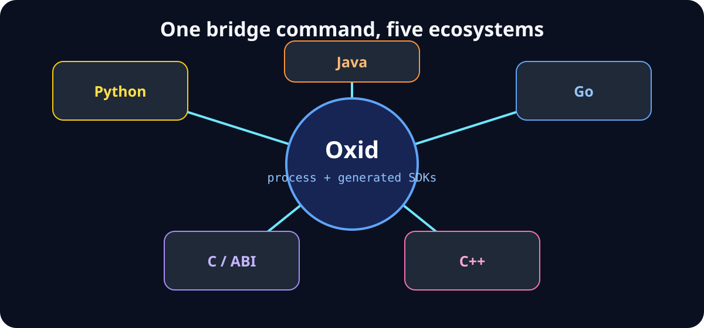
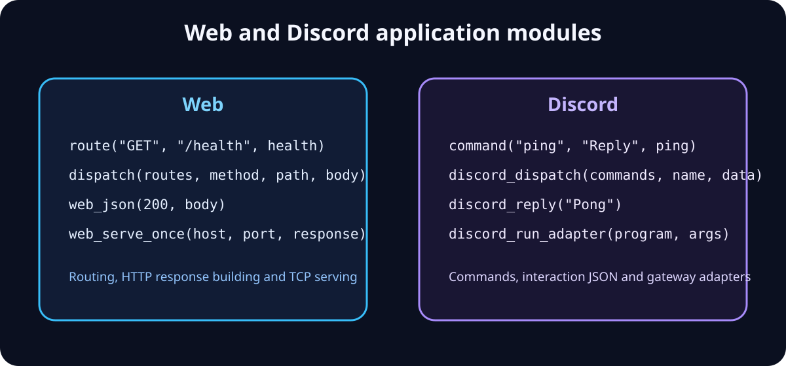

<div align="center">
  

  # Oxid

  **一個適合快速腳本、應用程式、套件與跨語言開發的精簡獨立語言。**

  [](https://github.com/YanagiKH/Oxid/actions/workflows/ci.yml)
  [](https://github.com/YanagiKH/Oxid/releases)
  [](LICENSE)

  [English](README.md) · [繁體中文](README_ZH.md) · [日本語](README_JP.md)
</div>

Oxid 0.8 將專案變成可直接使用的語言環境：精簡語法、直譯器與套件編譯器、專案工具、真正的 C/C++ 原生函式、Python／Java／Go 程序橋接、可運作的 Web 與 Discord 模組，以及附帶校驗碼的獨立版本。一般使用者只需安裝一個執行檔，**不需要 Rust**。

## 專案狀態

Oxid 現在可用於腳本、自動化、教學、原型、本機 HTTP 處理器、Discord 互動邏輯以及混合語言程序整合。發行執行檔內含解析器、執行環境、套件工具、C/C++ 橋接、套件編譯器、格式化工具、測試執行器、健康檢查及專案產生指令。

編譯器實作目前是 Rust stage-0 啟動層，並包含原生 C/C++ 元件。只有從原始碼建置 Oxid 本身時才需要 Rust；使用發行執行檔撰寫、執行、檢查、打包或橋接 Oxid 程式時不需要 Rust。完整的 Oxid 自宿主仍是明確的發展項目，因此本專案不會將預覽程式碼宣稱成已完成的自宿主編譯器。

## 為什麼選擇 Oxid

| 日常工作 | Rust 式繁瑣寫法 | Oxid 0.8 |
|---|---|---|
| 可變數值 | `let mut total = 0;` | `var total = 0;` |
| 輸出 | `println!("{value}");` | `say value;` |
| 短函式 | 函式區塊與明確回傳 | `fun double(n) => n * 2;` |
| 條件 | 強制使用 Rust 運算式語法 | `when ready { ... } otherwise { ... }` |
| 迭代 | 迭代器 trait 或手動迴圈 | `for item in values { ... }` |
| 管線 | 巢狀呼叫或轉接器 | `value |> clean |> encode;` |
| 非同步宣告 | 執行環境與 trait 設定 | `work fun fetch() => await request();` |
| 執行腳本 | 專案編譯流程 | `oxid run app.ox` |
| 單一成品 | 設定套件目標 | `oxid compile app.ox -o app.oxb` |
| 外部語言橋接 | 手動編寫主機端膠合程式 | `oxid bridge all bridges` |

Oxid 透過小型語言核心、一般腳本不需要依賴圖、預處理快取、遞迴模組快取，以及單次處理便將匯入內容編成一個 `.oxb` 套件來提升開發速度。效能會隨工作負載改變；請以儲存庫或應用程式的實際基準為準，不應假設相對 Rust 存在通用固定倍率。

## 架構



- 詞法分析器與解析器同時理解傳統關鍵字及 Oxid 簡寫。
- 執行環境支援數字、字串、布林、null、陣列、函式、任務、模組、常數、檔案、程序、C/C++ 原生呼叫及 HTTP 回應服務。
- 套件編譯器會遞迴內嵌匯入、展開巨集、驗證語法，並輸出單一 `.oxb` 成品。
- 標準函式庫以 `.ox` 模組編寫，提供集合、文字、工作流程、Web 路由、Discord 分派及語言橋接說明。
- 自動產生的橋接 SDK 可讓外部主機一致地啟動 Oxid，而不必嵌入編譯器內部結構。

## 快速開始



```bash
oxid new hello
cd hello
oxid run src/main.ox
oxid build
oxid test
```

產生的專案包含清單、原始碼入口、最小 prelude、範例、測試及建置腳本。`oxid build` 會驗證專案並產生 `.oxid/bin/hello.oxb`。

## 語言語法

### 傳統寫法

```oxid
fn double(value) {
    return value * 2;
}

fn main() {
    let values = range(1, 7);
    print map(values, double);
}
```

### Oxid 精簡寫法

```oxid
fun double(value) => value * 2;
fun label(value) => "value=" + str(value);

work fun greet(name) => "Hello, " + name;

fun main() {
    const values = range(1, 7);
    for value in values {
        when value % 2 == 0 { continue; }
        say value |> double |> label;
    }

    var job = greet("Oxid");
    say await job;
    say yes all (none == null);
}
```

這些簡寫是相容別名，而不是另一套不相容文法：`fun/fn`、`var/let`、`say/print`、`give/return`、`when/if`、`otherwise/else`、`loop/while`、`import/use`、`yes/true`、`no/false`、`none/null`、`all/and` 及 `any/or`。Oxid 也實作 `for … in`、`break`、`continue`、`%`、`|>`、`=>`、`async`、`await`、陣列、索引、賦值、註解與單行巨集。

## 安裝

### Linux 與 macOS 發行版安裝程式

安裝程式會偵測平台、下載最新版、驗證 SHA-256，並預設將 `oxid` 安裝至 `${HOME}/.local/bin`。

```bash
curl --proto '=https' --tlsv1.2 -sSf https://raw.githubusercontent.com/YanagiKH/Oxid/main/install.sh | sh
export PATH="$HOME/.local/bin:$PATH"
oxid --version
```

可設定 `OXID_INSTALL_DIR` 改變目錄，或設定 `OXID_VERSION=v0.8.0` 固定版本。已發布的 Unix 成品涵蓋 Linux x86_64、macOS x86_64 及 macOS arm64。

### Windows PowerShell 安裝程式

```powershell
Set-ExecutionPolicy -Scope Process Bypass
irm https://raw.githubusercontent.com/YanagiKH/Oxid/main/install.ps1 | iex
& "$env:LOCALAPPDATA\Oxid\bin\oxid.exe" --version
```

PowerShell 安裝程式會驗證壓縮檔校驗碼並支援 Windows x86_64。可使用 `OXID_INSTALL_DIR` 及 `OXID_VERSION` 覆寫預設值。

### 可攜式發行壓縮檔

1. 開啟 [GitHub Releases](https://github.com/YanagiKH/Oxid/releases)。
2. 下載對應作業系統的壓縮檔。
3. 使用旁邊的 `.sha256` 檔案驗證。
4. 將 `oxid` 或 `oxid.exe` 解壓至 `PATH` 內的目錄。

可攜式發行執行檔不需要任何語言執行環境。

### Cargo 或原始碼安裝

建置 stage-0 實作需要穩定版 Rust 以及 C/C++ 編譯器。

```bash
cargo install --git https://github.com/YanagiKH/Oxid --locked
# 或
git clone https://github.com/YanagiKH/Oxid.git
cd Oxid
make verify
sudo make install
```

### Docker

```bash
docker build -t oxid .
docker run --rm -v "$PWD:/workspace" oxid run /workspace/examples/hello.ox
```

容器會建置最佳化執行環境，並以非 root 使用者執行。

## 編譯與打包

```bash
oxid check src/main.ox
oxid compile src/main.ox -o app.oxb
oxid run app.oxb
oxid build
oxid clean
```

`.oxb` 是 Oxid 套件：匯入模組會去重並內嵌、巨集會展開，組合後的原始碼會經過語法驗證。它可以在執行相同或相容 Oxid 執行環境的系統間移動。`oxid build` 也會驗證清單依賴項，並在 `.oxid/` 下記錄建置報告。

## 跨語言橋接



### 從 Oxid 呼叫外部程式

```oxid
fun main() {
    say python("-c", ["print('hello from Python')"]);
    say go("tools/report.go", ["--format", "json"]);
    say process_output("java", ["-jar", "service.jar"]);
    say c_hash("native");
    say cpp_hash("bridge");
}
```

`process` 回傳結束碼；`process_output` 回傳標準輸出，並將失敗結束狀態轉成 Oxid 錯誤。`python`、`java` 與 `go` 提供精簡轉接。原生 `c_len`、`c_hash`、`cpp_len` 及 `cpp_hash` 會在每次 CI 建置中證明 ABI 邊界確實完成連結。

### 從其他語言呼叫 Oxid

```bash
oxid bridge python bridges/python
oxid bridge java bridges/java
oxid bridge go bridges/go
oxid bridge c bridges/c
oxid bridge cpp bridges/cpp
# 一次產生全部 SDK：
oxid bridge all bridges
```

產生的檔案使用各生態系統的標準程序 API，並公開小型 `run` 入口。這能保持協定穩定，同時讓主機端膠合層可替換。使用 C/C++ shell 轉接器時，請只使用受信任的檔名與命令參數。

## Web 模組



```oxid
import "stdlib/web.ox";

fun health(body) => web_json(200, "{\"status\":\"ok\"}");
fun echo(body) => web_text(200, body);

fun main() {
    const routes = [
        web_route_entry("GET", "/health", health),
        web_route_entry("POST", "/echo", echo)
    ];
    const response = web_dispatch(routes, "GET", "/health", "");
    web_serve_once("127.0.0.1", 8080, response);
}
```

`stdlib/web.ox` 提供路由項目、本機分派、文字／JSON 回應及單次請求 TCP HTTP 服務。使用 `oxid web new my-api` 產生可執行的 Web 設定檔。正式環境 TLS、長時間連線及框架專屬部署仍由轉接器負責。

## Discord 模組

```oxid
import "stdlib/bots/discord.ox";

fun ping(payload) => discord_reply("Pong: " + payload);

fun main() {
    const commands = [discord_command("ping", "Reply with pong", ping)];
    say discord_dispatch(commands, "ping", "interaction-data");
}
```

此模組可建立 Discord 互動回應、註冊指令、分派負載，並透過 `discord_run_adapter` 啟動 gateway 轉接器。使用 `oxid discord new my-bot` 產生可讀取 token 的專案骨架。HTTPS 及 WebSocket gateway 傳輸會隔離在可替換的轉接器，而不是固定寫死在語言核心中。

## 指令參考

| 指令 | 用途 |
|---|---|
| `oxid run <file>` | 執行 `.ox` 或 `.oxb` 原始碼 |
| `oxid check <file>` | 只進行詞法、預處理與解析，不執行 |
| `oxid compile <file> [-o output]` | 產生去重後的單一套件 |
| `oxid repl` | 啟動互動式直譯器 |
| `oxid new/init <name>` | 建立一般專案骨架 |
| `oxid web new <name>` | 建立 Web 專案骨架 |
| `oxid discord new <name>` | 建立 Discord bot 專案骨架 |
| `oxid bridge <target> [output]` | 產生 Python／Java／Go／C／C++ 主機 SDK |
| `oxid build` | 驗證清單並建立 `.oxid/bin/*.oxb` |
| `oxid test` | 執行語言煙霧測試與核心範例 |
| `oxid fmt [path]` | 格式化單一原始碼或整個專案 |
| `oxid watch <file>` | 專案檔案變更後重新執行 |
| `oxid script <name> [args]` | 執行 `oxid.toml` 腳本 |
| `oxid add <name> <target>` | 新增依賴項目 |
| `oxid doctor` | 檢查專案結構 |
| `oxid doc` | 產生內建 API 文件 |
| `oxid clean` | 移除 `.oxid` 快取／建置目錄 |
| `oxid bootstrap/frontend/...` | 執行以 Oxid 編寫的工具鏈檢查 |

## 儲存庫結構

```text
Oxid/
├── src/                  # stage-0 解析器、執行環境、CLI、套件器
├── stdlib/               # 以 Oxid 編寫的標準模組
│   ├── interop/          # C、C++、Python、Java、Go 橋接輔助
│   └── bots/discord.ox   # Discord 指令與回應模組
├── examples/             # 可執行語言、Web、bot 與橋接範例
├── tests/                # Oxid 煙霧測試程式
├── tools/                # 以 Oxid 編寫的專案／工具鏈腳本
├── native/               # 已連結的 C 與 C++ ABI 實作
├── scripts/              # 儲存庫及發行驗證
├── docs/assets/          # README 圖表
└── .github/workflows/    # 完整 CI 與校驗碼發行建置
```

## 驗證與發行

每次 push 與 pull request 都會執行：

- Rust 格式檢查，以及將警告視為錯誤的 Clippy；
- 語法、迴圈、管線、套件、橋接產生、JSON／Web 輔助與原生 C/C++ 連結單元測試；
- 對每個 `.ox` 檔案進行語法檢查；
- 執行所有測試、範例、工具、應用程式與套件 demo；
- 在 Linux x86_64、Windows x86_64、macOS x86_64 及 macOS arm64 進行最佳化建置；
- README 內容對齊、SVG XML、TOML、JSON、workflow、原始碼安裝及 Docker 檢查；
- 執行專案 `test`、`build` 及 `doctor` 指令。

版本標籤只會在可重用 CI 工作流程成功後，才打包獨立壓縮檔、產生 SHA-256 檔案並發布至 GitHub Releases。

## 獨立性與發展路線

Oxid 0.8 已達成使用者端與 Rust 分離：發行版使用者只接觸 `oxid` 與 `.ox/.oxb` 檔案。內部 stage-0 實作目前仍以 Rust 為基礎，同時持續把更多編譯器與工具行為移至 Oxid 模組。下一階段自宿主里程碑包括序列化 AST／bytecode 格式、以 Oxid 編寫的 bytecode emitter、可重現的啟動比較，以及逐項驗證並替換 stage-0 前端元件。

## 安全性

程序橋接會執行 Oxid 應用程式指定的程式。請勿把不受信任的執行檔路徑或 shell 片段交給自動產生的 C/C++ 轉接器。Web 服務刻意保持最小化且不提供 TLS。請依 [SECURITY.md](SECURITY.md) 私下回報漏洞。

## 貢獻與授權

請閱讀 [CONTRIBUTING.md](CONTRIBUTING.md)、執行 `make verify`，並確保公開儲存庫文件是提供所有使用者閱讀。Oxid 採用 [MIT](LICENSE) 或 [Apache-2.0](LICENSE-APACHE) 授權。
